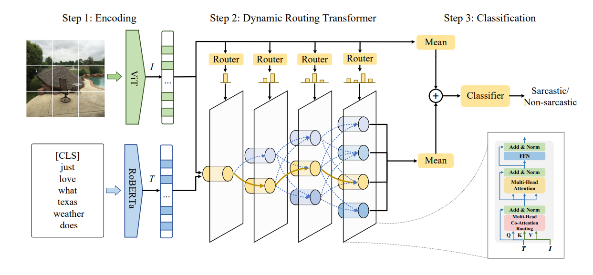

# DynRT
This repository contains (PyTorch) code and pre-trained models for Dynamic Routing Transformer Network (DynRT), described by the paper *Dynamic Routing Transformer Network for Multimodal Sarcasm Detection* accepted by ACL 2023.
## Quick links
- [DynRT](#dynrt)
  - [Quick links](#quick-links)
  - [Overview](#overview)
  - [Setup](#setup)
    - [Install dependencies](#install-dependencies)
    - [Datasets](#datasets)
    - [Pretrained model](#pretrained-model)
  - [Model](#model)
    - [Train/evaluate the model](#trainevaluate-the-model)
  - [CheckList](#checklist)
  - [Citation](#citation)
  - [Acknowledgement](#acknowledgement)

## Overview

In this work, we present a novel method for multimodal sarcasm detection. 
Please find more details of this work in our paper.
## Setup

### Install dependencies
Please install all the dependency packages using the following command:
```
pip install -r requirements.txt
```
### Datasets
Our experiments are based on Multimodal Sarcasm Detection (MSD) dataset. Please refer to our paper for more details about this datasets. The file size of image data is too large to submit as supplementary materials. 

Please download the image data from [data-of-multimodal-sarcasm-detection](https://github.com/headacheboy/data-of-multimodal-sarcasm-detection) and put all the images in the folder `dataset_image`. 

The text data and corresponding labels before preprocessing are in the folder `input/prepared`, which are the same with 
[data-of-multimodal-sarcasm-detection/text](https://github.com/headacheboy/data-of-multimodal-sarcasm-detection/tree/master/text). We follow [data-of-multimodal-sarcasm-detection/LoadData.py](https://github.com/headacheboy/data-of-multimodal-sarcasm-detection/blob/f42b16510208624d91fa545ca9bb64c6335f971e/codes/loadData.py#L80) to remove easy samples with regular words (e.g. humor, sarcasm, etc.) as all previous studies do. Please run `clean_dataset.py` to get preprocessed dataset in the folder `input/prepared_clean`. To save storage space, all the text data and corresponding labels are saved as binary files. To read these binary files, please use the following function:

```
def load_file(filename):
    with open(filename, 'rb') as filehandle:
        ret = pickle.load(filehandle)
        return ret
```


We preprocess the image and convert the image to a numpy array in order to save training time.  The numpy array file of the image will be saved in the fold `image_tensor/`. Please run the following command:
```
python convert_image_to_tensor_save.py
```

### Pretrained model
Download the pre-trained model roberta-base and corresponding files from 
[roberta-base](https://huggingface.co/roberta-base/). Put these files in `roberta-base/` folder.


## Model

### Train/evaluate the model
The parameter configuration files for training and testing are in the fold `config/`.
You can use `train.py` to train a DynRT model. A command template is as follows:
```bash
CUDA_VISIBLE_DEVICES=0 python train.py {path of the parameter configuration file} \
```
You can use `test.py` to evaluate an existing model. Please fill the model path as a value for the key  `test_on_checkpoint` in the config file. You can find our checkpoint file from the [ACL23-DynRT](https://drive.google.com/drive/folders/1sV9r-dlESCOeD2xsnpkd_lmgL_4MlT8U?usp=share_link). A command template is as follows:
```bash
CUDA_VISIBLE_DEVICES=0 python test.py {path of the parameter configuration file} \
```

The experimental results will be stored in a subfolder of the folder `exp/{date-time}/`. In this fold, `log.txt` is the log file, JSON file is the parameter configuration file. 

The configuration files are in the folder `config/`. A configuration file template for training is as follows:
```bash
{
    "info": {
        # The name of the model
        "name": "DynRT",
        # The config of the log
        "log": {
            "name": ""
        },
        # The device id of the GPU
        "device": [
            0
        ],
        # If test on checkpoint model, fill in the model file path, otherwise, fill in the "none"
        "test_on_checkpoint": "none",
        # If continue to train on the checkpoint model, fill in the model file path, otherwise, fill in the "none"
        "train_on_checkpoint": "none"
    },
    "opt": {
        "seed": 2,
        # the information of data, including text, image and label
        "dataloader": { 
            "requires": {
                "tokenizer_roberta": {
                    # the path of Roberta
                    "path": "pretrained_models/roberta-base"
                }
            },
            "loaders": {
                "text": {
                    # The path of text data
                    "data_path": "input/prepared_clean/",
                    # The max length of text
                    "len": 100,
                    # The pad index in the pretrained model
                    "pad": 1
                },
                "img": {
                    "data_path": "input/prepared_clean/",
                    # The path of the image tensor
                    "transform_image": "image_tensor/"
                },
                "label": {
                    "data_path": "input/prepared_clean/",
                    "test_label": true
                }
            },
            "batch_size": 32,
            "pin_memory": true,
            "num_workers": 0,
            "shuffle": true,
            "drop_last": false
        },
        "mode": [
            "train",
            "valid",
            "test"
        ],
        "checkpoint_step": 2,
        "lr_decay_list": [
            20,
            25,
            30
        ],
        "lr_decay_r": 0.8,
        "modelopt": {
            "name": "DynRT",
            "input1": "text",
            "input2": "img",
            "input3": "text_mask",
            "layer": 4,
            "tau_max": 10,
            # the order of masked sliding windows in our paper
            "ORDERS": [
                0,
                1,
                2,
                3
            ],
            "IMG_SCALE": 7,
            "dropout": 0.5,
            "hidden_size": 768,
            "ffn_size": 768,
            # The head of multi-head attention
            "multihead": 2,
            # the method for routing, "hard" for gumble softmax, "mean" for average probability 
            "routing": "hard",
            "BINARIZE": false,
            "len": 100,
            "glimpses": 1,
            "mlp_size": 768,
            "output_size": 768,
            # The order of ORDERS
            "orders": 4,
            "pooling": "avg",
            "classifier": "both",
            "roberta_path": "roberta-base/",
            "roberta_layer": 1,
            "vitmodel": "vit_base_patch32_224",
            "finetune": false
        },
        "optimizeropt": {
            "name": "Adam",
            "lr": 1e-06,
            "weight_decay": 0.01,
            "params": {
                "bertl_text": {
                    "lr": 3e-7
                },
                "vit": {
                    "lr": 3e-7,
                    "weight_decay": 0.01
                },
                "trar": {
                    "lr": 1e-06,
                    "weight_decay": 0.01
                },
                "classifier": {}
            }
        },
        "lossopt": {
            "name": "CrossEntropyLoss"
        },
        "total_epoch": 15,
        # The value of gradient clipping
        "clip": 10
    }
}

```


## CheckList 

We train our model on GeForce RTX 2080 Ti GPUs.

We take the average results of  5 runs for reports.

## Citation

If you find this repo useful for your research, please consider citing our paper.

```
@inproceedings{dynrt2023,
  author    = {Tian, Yuan and
               Xu, Nan and
               Zhang, Ruike and
               Mao, Wenji},
  title     = {Dynamic Routing Transformer Network for Multimodal Sarcasm Detection},
  booktitle = {Proceedings of the 61th Annual Meeting of the Association for Computational Linguistics},
  publisher = {Association for Computational Linguistics},
  pages = {2468--2480},
  year      = {2023}
}
```
## Acknowledgements

Thanks for the dataset from https://github.com/headacheboy/data-of-multimodal-sarcasm-detection

Thanks for the RoBERTa model from https://huggingface.co/roberta-base/

Thanks for the TRAR from https://github.com/rentainhe/TRAR-VQA

